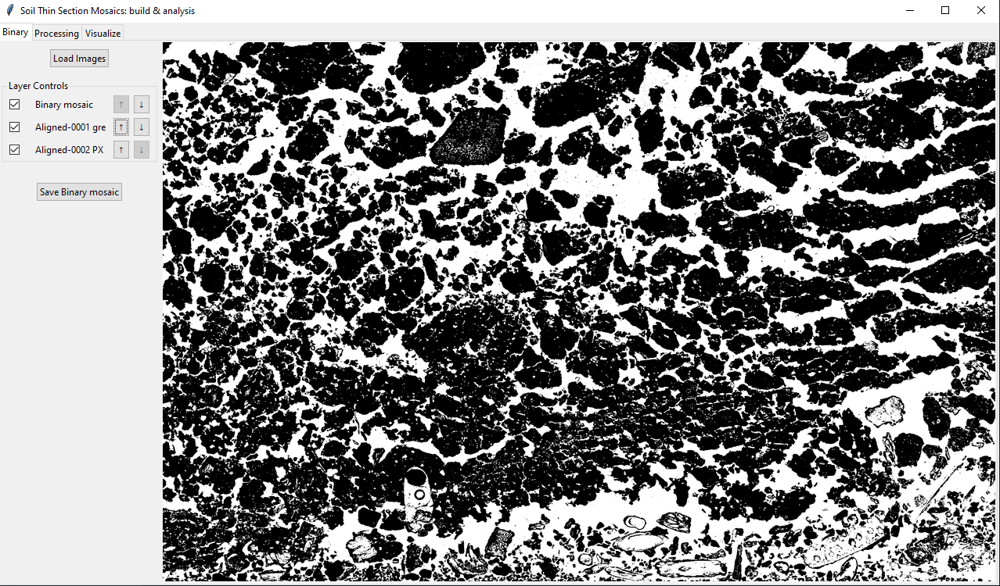
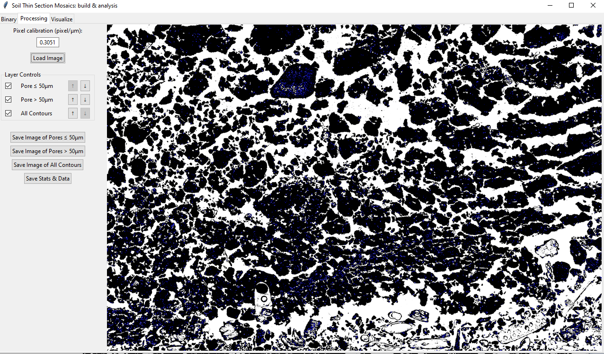
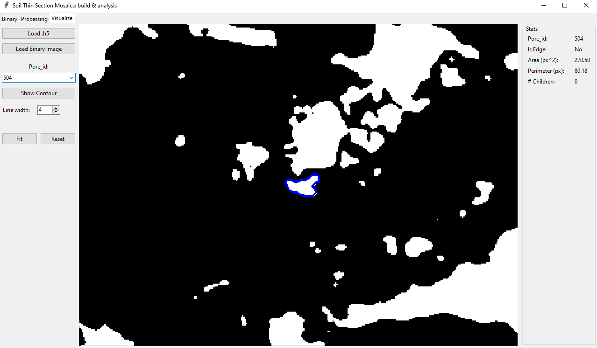

# Soil Thin Section Mosaics: Build and Analysis

Desktop toolkit for building, processing, and exploring soil thin section mosaics.

## What This Project Does

- Builds a binary mosaic from aligned grayscale images.
- Processes pores by size classes using contour analysis.
- Exports images, HDF5 contour data, and spreadsheet summaries.
- Visualizes selected pore contours and per-pore statistics.

## Installation

From the repository root:

    python -m pip install -e .

Install development dependencies:

    python -m pip install -e .[dev]

## Run the App

    stsm

Alternative launch:

    python -m stsm

## One-Command Quality Check

Main command:

    .\scripts\qa.ps1

Optional auto-fix mode (imports and formatting):

    .\scripts\qa.ps1 -Fix

This command runs, in order:

- Editable install with development dependencies
- Ruff lint checks
- Black format check
- Pytest test suite

## Tabs Overview

### Binary Tab

Purpose:
- Load two input images and create the binary mosaic layer.
- Toggle layer visibility and reorder overlays.
- Save the generated binary mosaic.

Screenshot:

### Processing Tab

Purpose:
- Set calibration in pixel per micrometer.
- Process full image or ROI.
- Split pores into <= 50 um and > 50 um classes.
- Save contour visualizations and export stats and data.

Screenshot:

### Visualize Tab

Purpose:
- Load contour dataset from HDF5 and corresponding binary image.
- Select a pore id and inspect contour geometry.
- Inspect per-pore stats such as area, perimeter, and edge flag.

Screenshot:

### Acquire Tab (TBD)

Planned:
- Guided image acquisition workflow.
- Hardware and capture presets.

### Build Tab (TBD)

Planned:
- Assisted stitching and mosaic assembly.
- Alignment quality checks before binary generation.

### Align Tab (TBD)

Planned:
- Advanced registration and correction tools.
- Multi-image alignment diagnostics.

## Project Layout

- src/stsm/app.py: application window and tab wiring
- src/stsm/binary_tab.py: binary tab UI and controls
- src/stsm/processing_tab.py: processing tab UI and controls
- src/stsm/visualize_tab.py: contour visualization tab
- src/stsm/load_save.py: load/save and export utilities
- src/stsm/proc_mosaic.py: contour and pore processing logic
- src/stsm/display.py: canvas rendering helpers
- src/stsm/layer_controls.py: layer visibility and ordering
- src/stsm/roi.py: ROI selection and handoff to processing

## Suggested Next Improvements

- Add a small sample dataset for quick demos.
- Add regression tests for spreadsheet and HDF5 exports.
- Add release workflow with tagged builds.
